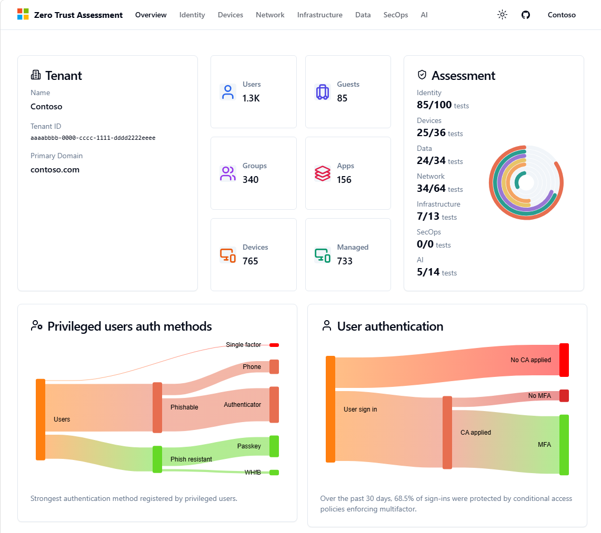
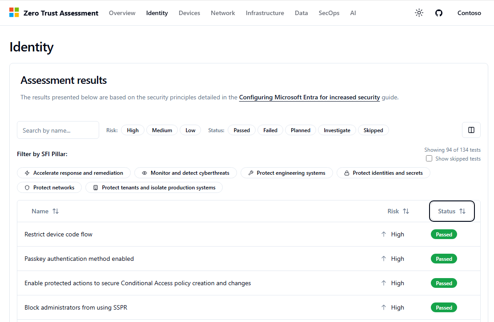
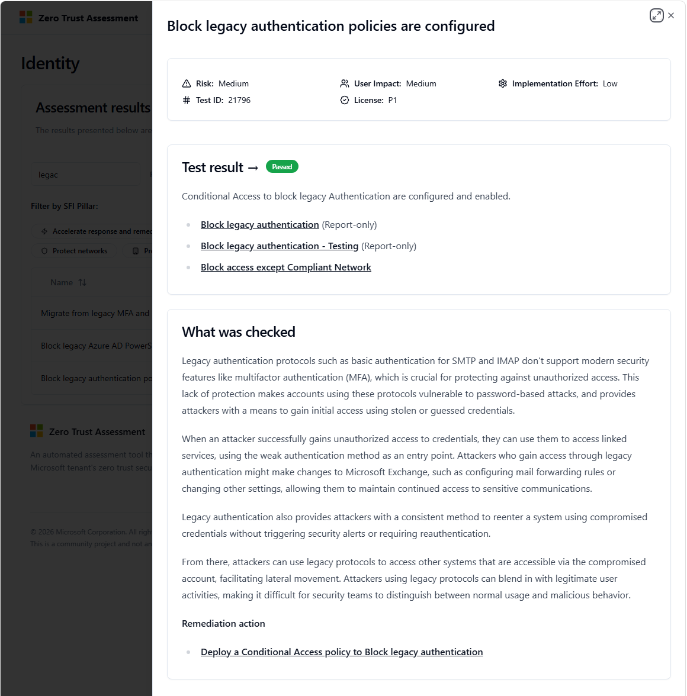

# Microsoft Zero Trust Assessment - Preview

## About the Zero Trust Assessment tool

As the security threat landscape evolves, Microsoft continues to respond and re-evaluate default tenant security settings.​ Based on insights, experience and learnings Microsoft will continue to change the default tenant security settings in the product over time.

Microsoft publishes the [Entra Security Recommendations](https://aka.ms/entra/security) and [Intune Security Recommendations](https://aka.ms/intune/security) guidance to help customers to act more quickly using Microsoft's latest guidance, re-evaluate existing tenant security settings and make change in advance of our product updates.

Manually checking a tenant's configuration against the published guidance can be time consuming and error-prone. The Zero Trust Assessment PowerShell module was built to help with this activity.

The Zero Trust Assessment module in this private preview helps customers perform an automated security assessment. This works by assessing the tenant configuration and provides guidance on how to improve the security of the tenant.

The assessment is organized into **pillars**. The **Identity**, **Devices**, **Network**, and **Data** pillars are generally available. Additional preview pillars (**Infrastructure**, **SecOps**, and **AI**) can be enabled with the `-Preview` switch. See [Preview pillars](#preview-pillars-infrastructure-secops-and-ai) for details.

## Prerequisites

- PowerShell v7

> The assessment uses PowerShell modules that are only compatible with
> PowerShell 7. Install PowerShell v7 if not already installed:
> [Installing PowerShell on Windows - PowerShell \| Microsoft
> Learn](https://learn.microsoft.com/en-us/powershell/scripting/install/installing-powershell-on-windows?view=powershell-7.4#installing-the-msi-package)

- Windows
  - A full assessment requires **Windows**. Two of the bundled modules — SharePoint Online (`Microsoft.Online.SharePoint.PowerShell`) and Azure Information Protection (`AipService`) — are Windows-only. On non-Windows platforms these services are skipped and the related tests do not run.

- Global Administrator role
  - Note: The module supports running the assessment as a Global Reader, but the Global Administrator role is required to initially connect to Microsoft Graph and consent to permissions.

- Uninstall previous versions
  - If you have installed previous versions of the Zero Trust Assessment, [uninstall](#how-can-i-uninstall-previous-versions-of-the-zero-trust-assessment) before continuing.
  
## Install the PowerShell modules

Follow these steps to install the assessment and connect to Microsoft Graph and your tenant. 

### Open PowerShell 7

Open PowerShell 7 by searching in your Start Menu for `PowerShell 7`, or open PowerShell 7 directly via the path: `C:\Program Files\PowerShell\7\pwsh.exe`

_When prompted to install modules from an untrusted repository, choose `Yes to All`._

### Install Zero Trust Assessment module

Install the `ZeroTrustAssessment` module using the following command.

```powershell
Install-PSResource -Name ZeroTrustAssessment -Scope CurrentUser
```

> **Tip:** New assessment checks and fixes are shipped in preview (prerelease) builds before they are rolled into a stable release. To get the **latest implemented checks and fixes**, install the prerelease build by adding the `-Prerelease` switch:
>
> ```powershell
> Install-PSResource -Name ZeroTrustAssessment -Prerelease -Scope CurrentUser
> ```

## Bundled PowerShell modules

The Zero Trust Assessment connects to several Microsoft cloud services, each of which relies on its own PowerShell module. Rather than depending on whatever versions happen to be installed on your machine, the assessment **bundles a specific, pinned version of every required module**. These bundled modules are downloaded into a private module cache the first time you connect (`%APPDATA%\ZeroTrustAssessment\Modules` on Windows) and are loaded only for the assessment.

> **Important:** The Zero Trust Assessment is **validated and tested only against the exact module versions listed below**. This is why they are bundled together and isolated from your global module set. Having other (conflicting) versions of these modules installed on the same machine can cause assembly/DLL conflicts (for example `Microsoft.Identity.Client.dll`) and lead to sign-in or runtime failures. See [Recommended: use a dedicated clean VM](#recommended-use-a-dedicated-clean-vm).

| Module | Version | Service | Platform |
|--------|---------|---------|----------|
| `PSFramework` | 1.13.419 | Logging / framework | All |
| `Microsoft.Graph.Authentication` | 2.35.0 | Microsoft Graph | All |
| `Microsoft.Graph.Beta.Teams` | 2.35.0 | Microsoft Graph (Teams beta) | All |
| `Az.Accounts` | 4.0.2 | Azure | All |
| `ExchangeOnlineManagement` | 3.9.0 | Exchange Online & Security &amp; Compliance | All |
| `Microsoft.Online.SharePoint.PowerShell` | 16.0.26914.12004 | SharePoint Online | Windows only |
| `AipService` | 3.0.0.1 | Azure Information Protection (Purview) | Windows only |

## Connect to Microsoft 365 and Azure services

Earlier versions of the assessment connected only to Microsoft Graph and Azure. The assessment now connects to **six** services so it can evaluate all pillars:

| # | Service | Sign-in cmdlet used |
|---|---------|---------------------|
| 1 | Microsoft Graph | `Connect-MgGraph` |
| 2 | Azure | `Connect-AzAccount` |
| 3 | Azure Information Protection (Purview) | `Connect-AipService` |
| 4 | SharePoint Online | `Connect-SPOService` |
| 5 | Exchange Online | `Connect-ExchangeOnline` |
| 6 | Security &amp; Compliance | `Connect-IPPSSession` |

> **Expect multiple sign-in prompts.** Each service authenticates separately, so during `Connect-ZtAssessment` you will see **at least one sign-in prompt per service**. SharePoint Online additionally opens your **default system browser** to complete its sign-in. This is expected behavior — see the FAQ entry [Why do I get multiple sign-in prompts?](#why-do-i-get-multiple-sign-in-prompts).
>
> **Tip:** To make the sign-in experience smoother, we recommend running the assessment while **signed in to Windows as the same account** that runs the assessment (or adding that account as a local user on the machine). This lets the interactive and system-browser prompts reuse your existing Windows session instead of prompting repeatedly.

When connecting using Microsoft Graph PowerShell, the following permissions are requested. You are presented with a permissions requested page that you must consent to be able to run the assessment.

The consent prompt is only displayed if the Graph PowerShell app does not already have these permissions.

> **Note:** To read Custom Security Attributes on service principals, the account running the assessment must also be assigned the **Attribute Assignment Reader** (or **Attribute Assignment Administrator**) Entra ID role. Without this role, Custom Security Attribute values will be returned as null.

- Application.Read.All
- AuditLog.Read.All
- CopilotPackages.Read.All
- CrossTenantInformation.ReadBasic.All
- CustomSecAttributeAssignment.Read.All
- DeviceManagementApps.Read.All
- DeviceManagementConfiguration.Read.All
- DeviceManagementManagedDevices.Read.All
- DeviceManagementRBAC.Read.All
- DeviceManagementServiceConfig.Read.All
- Directory.Read.All
- DirectoryRecommendations.Read.All
- EntitlementManagement.Read.All
- IdentityRiskEvent.Read.All
- IdentityRiskyServicePrincipal.Read.All
- IdentityRiskyUser.Read.All
- LifecycleWorkflows-Workflow.Read.All
- NetworkAccess.Read.All
- Policy.Read.All
- Policy.Read.ConditionalAccess
- Policy.Read.PermissionGrant
- PrivilegedAccess.Read.AzureAD
- PrivilegedAssignmentSchedule.Read.AzureADGroup
- PrivilegedEligibilitySchedule.Read.AzureADGroup
- Reports.Read.All
- RoleManagement.Read.All
- SecurityAlert.Read.All
- SecurityEvents.Read.All
- SecurityIdentitiesHealth.Read.All
- SecurityIdentitiesSensors.Read.All
- SecurityIncident.Read.All
- UserAuthenticationMethod.Read.All

Run the following command to connect to the services and consent to the permissions using a Global Administrator account. We recommend **explicitly specifying the tenant** you want to assess:

```powershell
Connect-ZtAssessment -Tenant <tenant>
```

The `-Tenant` parameter accepts either the **tenant ID (GUID)** or any **verified domain name** of the tenant, for example:

```powershell
# Using the tenant ID (GUID)
Connect-ZtAssessment -Tenant 00000000-0000-0000-0000-000000000000

# Using a verified domain name
Connect-ZtAssessment -Tenant contoso.onmicrosoft.com
```

If you omit `-Tenant`, you are connected against a multi-tenant (`/organizations`) context and the tenant is inferred from the account you sign in with. Specifying the tenant avoids accidentally assessing the wrong tenant when your account has access to more than one.

### Sign into each service

When prompted, sign in as a Global Administrator. Because the assessment connects to six services (Graph, Azure, Azure Information Protection, SharePoint Online, Exchange Online, and Security &amp; Compliance), **you will be prompted multiple times** - at least once per service, plus a system-browser prompt for SharePoint Online. Complete each prompt in the order it appears.

For the Microsoft Graph consent prompt, review and accept the requested permissions. The next time you connect, you won't be required to reconsent to the permissions.

The Azure sign in is required to check for export of Audit and sign in logs. If you don't have Azure, you can close the Azure window without signing in and ignore the warning - the test that relies on Azure will be skipped. If you have multiple subscriptions, select a tenant and subscription when prompted.

## Run the assessment

This assessment is a read-only assessment, and all data is run and
stored locally on the desktop. We recommend storing this report securely and deleting the generated folder and its contents from the local drive once the assessment is complete.

After providing Administrator consent to the permissions, you can run the assessment with an account that has been assigned the **Global Reader** role.

> **Note:** Some tests that evaluate Exchange Online protection policies require the **Security Reader** role in the Microsoft Defender portal in addition to Global Reader. Without this role, those Exchange Online cmdlets will return permission errors and the affected tests may generate unexpected output.

We recommend the following two-step flow. First connect to the specific tenant you want to assess, then run the assessment:

```powershell
# 1. Connect to the target tenant (GUID or verified domain name)
Connect-ZtAssessment -Tenant contoso.onmicrosoft.com

# 2. Run the assessment against the connected tenant
Invoke-ZtAssessment
```

> `Invoke-ZtAssessment` runs against the tenant you are already connected to; it does not take a `-Tenant` parameter. Set the tenant when you call `Connect-ZtAssessment`.

> The assessment may take more than 24 hours to run on large
tenants. Please do not abort the assessment while it is running (even if warnings and errors are logged)

If you are only interested in the Devices (Intune) pillar (which takes less than 5 minutes to run), you can use the following command:

```powershell
Invoke-ZtAssessment -Pillar Devices
```

The results are created in the current working folder `.\ZeroTrustReport\ZeroTrustAssessmentReport.html`. After the
assessment completes, the report is automatically opened in the default browser.

You can use the `-Path` parameter to provide a custom location to
store the assessment report. For example, the following command produces the report in the folder
`C:\MyAssessment01\ZeroTrustAssessmentReport.html`

```powershell
Invoke-ZtAssessment -Path C:\MyAssessment01
```

### `Invoke-ZtAssessment` parameters

The most commonly used parameters are described below. All parameters are optional.

| Parameter | Description |
|-----------|-------------|
| `-Path <string>` | Folder where the report and exported data are written. Defaults to `./ZeroTrustReport` in the current directory. |
| `-Pillar <string>` | Which pillar to assess. One of `All` (default), `Identity`, `Devices`, `Network`, `Data`, `Infrastructure`, `SecOps`, or `AI`. The last three are preview pillars and require `-Preview`. |
| `-Preview` | Enables the preview pillars (`Infrastructure`, `SecOps`, `AI`). Without this switch only the generally available pillars run. See [Preview pillars](#preview-pillars-infrastructure-secops-and-ai). |
| `-Resume` | Reuses the data that was already exported to `-Path` on a previous run, skipping data collection and database rebuild, and re-runs only the tests/report. Useful to regenerate the report or re-run tests without re-exporting. The pillar must match the pillar used for the original export. |
| `-Tests <id[,id...]>` | Runs only the specified test ID(s) (exact match, no wildcards). If omitted, all tests for the selected pillar run. Example: `-Tests 21770, 21771`. |
| `-Days <1-30>` | Number of days of sign-in logs to query (1-30, default 30). |
| `-MaximumSignInLogQueryTime <minutes>` | Maximum time to spend querying sign-in logs (default 60; `0` = no limit). |
| `-NoBrowser` | Suppresses automatically opening the progress dashboard and the final report in the browser. |
| `-ShowLog` | Prints a high-level summary of log messages to the console. |
| `-ExportLog` | Writes the log to a file. |
| `-ConfigurationFile <path>` | Path to a JSON configuration file. Command-line parameters override values from the file. |
| `-DisableTelemetry` | Disables telemetry collection (by default only the tenant ID is collected). |
| `-Timeout <timespan>` | Maximum time to wait for all tests before giving up (default 24 hours). |
| `-TestTimeout <minutes>` | Maximum time a single test may run (default 60; `0` = disabled). |
| `-ExportThrottleLimit <n>` / `-TestThrottleLimit <n>` | Maximum number of parallel data collectors / tests (default 5 each). |

### Preview pillars (Infrastructure, SecOps, and AI)

By default the assessment runs only the generally available pillars: **Identity**, **Devices**, **Network**, and **Data**.

The newest pillars - **Infrastructure**, **SecOps**, and **AI** - are in preview and are gated behind the `-Preview` switch. To include them, add `-Preview`:

```powershell
# Run all pillars, including the preview pillars
Invoke-ZtAssessment -Preview

# Run a single preview pillar (still requires -Preview)
Invoke-ZtAssessment -Pillar SecOps -Preview
```

If you select a preview pillar with `-Pillar` but omit `-Preview`, the assessment stops and reminds you to add the `-Preview` switch.

### Recommended: use a dedicated clean VM

Because the assessment is validated against a specific, pinned set of module versions (see [Bundled PowerShell modules](#bundled-powershell-modules)), other versions of those modules already installed on your machine can cause assembly/DLL conflicts and sign-in or runtime failures.

For the most reliable experience we recommend running the assessment on a **dedicated, clean Windows VM** that is used only for the Zero Trust Assessment and does **not** have any other (conflicting) versions of the required modules installed - for example, an existing installation of Microsoft Graph PowerShell, the Az modules, ExchangeOnlineManagement, SharePoint Online, or AipService. Starting from a clean machine avoids the DLL conflicts described in the FAQ and keeps the bundled, tested module versions isolated.

## Review assessment results

After the assessment completes, you are redirected to the **Overview** tab of the report in your default browser. The **Overview** tab displays key Zero Trust related information about the tenant.



The **Identity**, **Devices**, **Network**, **Data** (and **Infrastructure**, **SecOps** and **AI** as _preview_) tabs display the list of tests that were run against the tenant and provide recommendations on addressing the tenant configuration information.



Select a result to see more information and remediation actions.



## Reporting issues

If you run into any issues or have queries about the results, reach out to your account contact that suggested you run the assessment.

### Export troubleshooting logs

If an issue occurs, export a log using these instructions.

Run the following command in the same session where you ran the
assessment to create the export package (update the date to reflect the date of your run).

```powershell
New-PSFSupportPackage -Path C:\AssessmentLog_2025_01_01 -Force
```

Zip this folder along with the folder that was created by
Invoke-ZtAssessment (default is `ZeroTrustAssessment`) and share it with your contact at Microsoft.

> **Warning:** The troubleshooting package and the assessment output folder can contain **sensitive and personally identifiable information (PII)** about your tenant - for example, the Global Administrator account identifier (UPN) used to sign in, other user or account identifiers, tenant IDs, and configuration details. **Do not post this package publicly** (for example, on GitHub issues, forums, or social media). Share it only through a private, trusted channel directly with your Microsoft contact.

## Removing the Zero Trust assessment

To remove the assessment, follow these steps.

- Remove PowerShell module.
- Remove App Reg + consent.
- Delete the folder that was created by the assessment.

## Feedback / Issues

The **Identity** tab shows the results of the assessment on your tenant.

The other tabs are in progress. Feel free to share feedback on the
report. If you have any feedback or issues, reach out to your account contact that suggested you run the assessment or post in the private preview Teams channel.

## FAQs

### How can I uninstall previous versions of the Zero Trust Assessment?

Run the following commands to ensure all versions of the past modules are uninstalled.

Next restart PowerShell and follow the instructions in this page to install the latest version.

```powershell
Uninstall-PSResource ZeroTrustAssessment -Version '*'
Uninstall-PSResource ZeroTrustAssessmentv2 -Version '*'
```

### Could not load file or assembly Microsoft.Graph.Authentication

This error happens when you have conflicting versions of Microsoft Graph PowerShell installed.

To fix this error we recommend uninstalling all Microsoft Graph PowerShell modules installed on your system. You can use a helper module like [uninstall-graph.merill.net](https://uninstall-graph.merill.net/) to run the cleanup.

When uninstalling Microsoft Graph you should also uninstall versions of Zero Trust Assessment, restart PowerShell and then try a fresh install. 

This is the order of running the cmdlets.

```powershell
Install-PSResource Uninstall-Graph
Uninstall-PSResource ZeroTrustAssessment -Version '*'
Uninstall-PSResource ZeroTrustAssessmentv2 -Version '*'
Uninstall-Graph
```
Close all open PowerShell windows.

Start a new PowerShell session.

```powershell
Install-PSResource ZeroTrustAssessment -Scope CurrentUser
```

Note: The Zero Trust Assessment module will automatically install the required Graph PowerShell modules.

### Why do I get multiple sign-in prompts?

This is expected. The assessment connects to six separate services - Microsoft Graph, Azure, Azure Information Protection (Purview), SharePoint Online, Exchange Online, and Security &amp; Compliance - and each one authenticates independently. During `Connect-ZtAssessment` you will therefore see **at least one sign-in prompt per service**. SharePoint Online additionally opens your **default system browser** to complete its sign-in.

To reduce how often you are prompted, sign in to Windows as (or add as a local user) the same account that runs the assessment, so the prompts can reuse your existing Windows session. See [Connect to Microsoft 365 and Azure services](#connect-to-microsoft-365-and-azure-services).

### The HTML report shows "Unexpected Application Error! Invalid array length"

Some releases (including 2.3.0 and 2.4.0) can produce a report that fails to render in the browser with an error similar to:

```text
Unexpected Application Error!
Invalid array length
```

The data export, database, and tests complete successfully - only the rendering of the generated HTML report fails. This is a known issue tracked in the following GitHub issues:

- [#1235 - ZTA 2.3.0 completes successfully but the generated HTML report crashes when rendering](https://github.com/microsoft/zerotrustassessment/issues/1235)
- [#1272 - "Unexpected Application Error! Invalid array length" using version 2.3.0](https://github.com/microsoft/zerotrustassessment/issues/1272)
- [#1310 - "Unexpected Application Error! Invalid array length" in HTML report](https://github.com/microsoft/zerotrustassessment/issues/1310)
- [#1388 - Post completion of scripts, getting multiple errors and HTML error](https://github.com/microsoft/zerotrustassessment/issues/1388)

The fix is included in the latest **preview (CI) build** published to the PowerShell Gallery. Install it with the `-Prerelease` switch:

```powershell
# Optional: remove the current version first
Uninstall-PSResource ZeroTrustAssessment -Version '*'

# Install the latest preview (CI) build that includes the fix
Install-PSResource -Name ZeroTrustAssessment -Prerelease -Scope CurrentUser
```

If you already have the exported data from a previous run, you can regenerate just the report with the fixed build using the `-Resume` switch instead of re-exporting all data:

```powershell
Invoke-ZtAssessment -Path <your report path> -Resume
```

### How can I know what the script is doing?

- The code for this assessment is open source and can be reviewed at `https://github.com/microsoft/zerotrustassessment/tree/psnext/src/powershell`

### Error: The type initializer for 'DuckDB.NET.Data.DuckDBConnectionStringBuilder' threw an exception

On a new installation of Windows you may run into the following error.

```text
The type initializer for 'DuckDB.NET.Data.DuckDBConnectionStringBuilder' threw an exception.
Inner exception: Unable to load DLL 'duckdb' or one of its dependencies: The specified module could not be found. (0x8007007E)
Inner exception type: DllNotFoundException
```

This error occurs because you are running on a system that does not include Microsoft Visual C++ 2015-2022 Redistributable (x64) - Microsoft.VCRedist.2015+.x64.

VCRedist is usually installed when you install Microsoft products like Microsoft Office or Entra Connect Sync. If this is a new device you may need to manually install this component using the link below.

[VCRedistributable Download](https://learn.microsoft.com/en-us/cpp/windows/latest-supported-vc-redist?view=msvc-170#latest-microsoft-visual-c-redistributable-version)

### Is this an official Microsoft product?

No. It is a community project that is maintained by Microsoft employees. The app is provided as-is and is not supported through any Microsoft support program or service. Please do not contact Microsoft support with any issues or concerns.

### How do I get support?

Please raise an issue on the [Zero Trust Assessment GitHub repo](https://github.com/microsoft/zerotrustassessment/issues).
